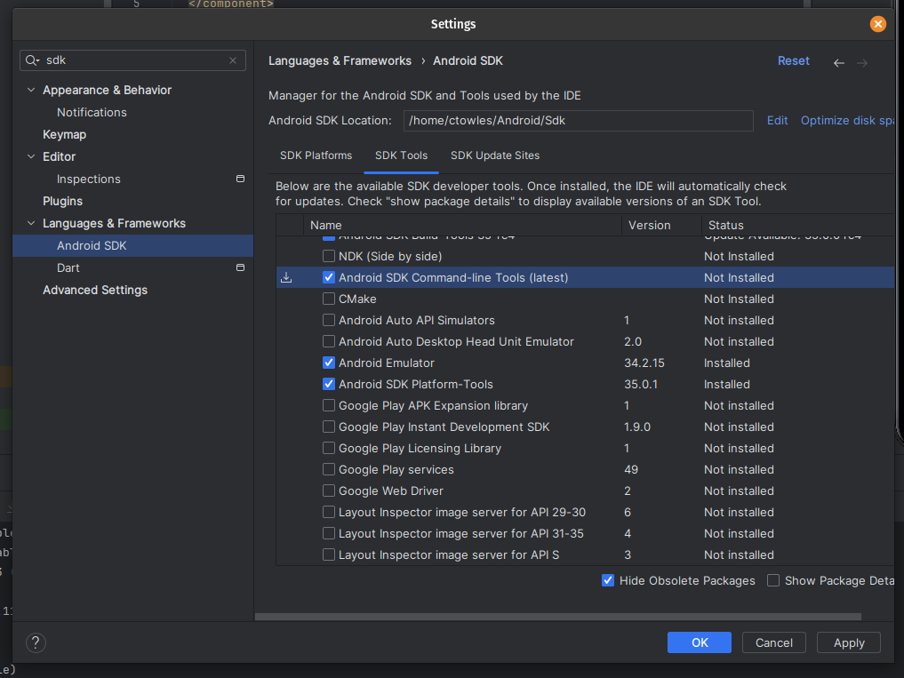
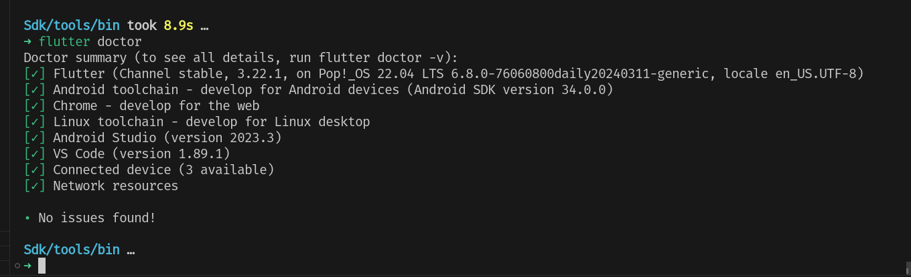

# Android Studio Install Guide Linux


download from https://developer.android.com/studio

```bash

cd ~/Downloads
ls android-studio-* 

tar -xvzf android-studio-2023.3.1.19-linux.tar.gz  /usr/share/

sudo mv android-studio/ /usr/share/

cd /usr/share/android-studio/

# run it

/usr/share/android-studio/bin/studio.sh

```


Install Plugins

- Flutter
- Dart

Restart IDE

Create Test project.

Chose Device Manager and start the default Device.


## Add to profile


```bash


# add android Studio
alias studio=/usr/share/android-studio/bin/studio.sh

#export ANDROID_HOME
export ANDROID_HOME=$HOME/Android/Sdk

# setup ANDROID
export PATH=$PATH:$ANDROID_HOME/bin
export PATH=$PATH:$ANDROID_HOME/tools
# we not going to add "$ANDROID_HOME/tools/bin" on linux, these are the unix tools, we'll install below
export PATH=$PATH:$ANDROID_HOME/platform-tools

```

## Add to POP_OS App List

```bash
sudo touch /usr/share/applications/android-studio.desktop
code /usr/share/applications/android-studio.desktop
```
> [!NOTE]
> if you can't add the application as a favorite. You need the on StartupWMClass set. set https://askubuntu.com/questions/1378642/application-in-the-dock-cant-be-added-to-favourites on getting the value needed.


copy these contents.

```toml
[Desktop Entry]
Name=Android Studio
Comment=Android Studio
Exec=/usr/share/android-studio/bin/studio.sh
Type=Application
Terminal=false
Icon=/usr/share/android-studio/bin/studio.png
NoDisplay=false
StartupWMClass=jetbrains-studio


```


## Flutter SDK

https://docs.flutter.dev/get-started/install/linux/android

```bash
sudo apt-get update -y && sudo apt-get upgrade -y;
sudo apt-get install -y curl git unzip xz-utils zip libglu1-mesa

sudo apt-get install \
    libc6:i386 libncurses5:i386 \
    libstdc++6:i386 lib32z1 \
    libbz2-1.0:i386

```

First create directory for the SDK.

```bash
export FLUTTER_SDK_BASE=$HOME/Android/

```

Now use VScode with Flutter Extension enabled to download the `Run Flutter Doctor`.

That will fail and give you option to install Flutter SDK. choose `$FLUTTER_SDK_BASE` which will create the `$FLUTTER_SDK_BASE/flutter` folder.

After that runs.


### Add to profile


```bash


#export ANDROID_HOME
export FLUTTER_SDK_BASE=$HOME/Android/

# setup flutter in path
export PATH=$PATH:$FLUTTER_SDK_BASE/flutter/bin


```

now test
```bash
flutter
```

Now test everything is setup.


```bash
flutter doctor

adb

```


You will likely still need to accept license and install a few more apt packages.


## Java SDK 

the `sdkmanager` will need `JAVA_HOME` set.

Install `openjdk-18-jdk`. To find its install folder.

```bash
sudo apt install openjdk-18-jdk
```

confirm install.
```bash
java --version
```

Now Lets find its home folder.

```bash
which java
# follow that link 
ls /usr/bin/java

# and follow that link again.
ls /etc/alternatives/java

```
 
Which resulted in `/usr/lib/jvm/java-18-openjdk-amd64/bin/java`.


Not add `JAVA_HOME` to profile and without `/bin` on the end.


```bash
export JAVA_HOME=/usr/lib/jvm/java-18-openjdk-amd64
```
Now in new terminal lets test it.

```bash
echo "java home: $JAVA_HOME"
```

Following <https://stackoverflow.com/questions/46402772/failed-to-install-android-sdk-java-lang-noclassdeffounderror-javax-xml-bind-a> to reslove issue when trying to run `sdkmanager`

Install the Android cmd tools from with in Android Studio on linux.



Now add the path to your profile.

```bash
export PATH=$PATH:$ANDROID_HOME/cmdline-tools/latest/bin
```

now lets test `sdkmanager`.

```bash
sdkmanager --version
```

## Final Check

Ensure all the checks pass.

```bash
flutter doctor 

```

