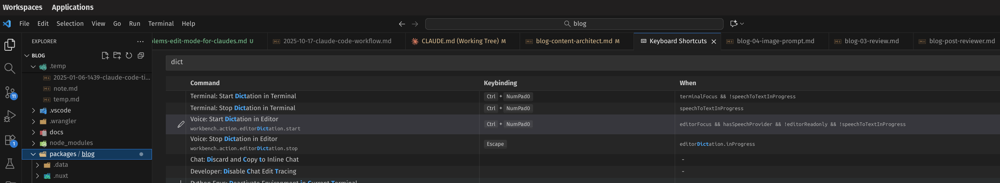

# VSCode

- Always set file save for `afterDelay`

## Dictation

Install Microsoft Speech
https://marketplace.visualstudio.com/items?itemName=ms-vscode.vscode-speech

Current key bindings for dictation



### Key bindings

**Fix shift+enter to send newline in terminal for Claude Code**

```json
{
  "key": "shift+enter",
  "command": "workbench.action.terminal.sendSequence",
  "args": {
    "text": "\u001b\r"
  },
  "when": "terminalFocus"
}
```

**Remove conflicting ctrl+g bindings (allows Claude to open prompt in editor)**

```json
{
  "key": "ctrl+g",
  "command": "-workbench.action.gotoLine"
},
{
  "key": "ctrl+g",
  "command": "-workbench.action.terminal.goToRecentDirectory",
  "when": "terminalFocus && terminalHasBeenCreated || terminalFocus && terminalProcessSupported"
}
```

**Remap quick open to ctrl+alt+p (avoids zellij conflict)**

```json
{
  "key": "ctrl+alt+p",
  "command": "workbench.action.quickOpen"
},
{
  "key": "ctrl+p",
  "command": "-workbench.action.quickOpen"
}
```

**Remap terminal paste to ctrl+v**

```json
{
  "key": "ctrl+v",
  "command": "workbench.action.terminal.paste",
  "when": "terminalFocus && terminalHasBeenCreated || terminalFocus && terminalProcessSupported"
},
{
  "key": "ctrl+shift+v",
  "command": "-workbench.action.terminal.paste",
  "when": "terminalFocus && terminalHasBeenCreated || terminalFocus && terminalProcessSupported"
}
```

## Testing performance tip posted by Jonson Chu

https://x.com/kyrylosilin/status/1849921659546812732

```json
"disable-hardware-acceleration": true
```

## Wrap of Editor

```json
{
  "editor.wordWrap": "on",
  "editor.wrappingIndent": "same",
  "editor.wordWrapColumn": 160,
  "editor.wordWrapMinified": true
}
```
