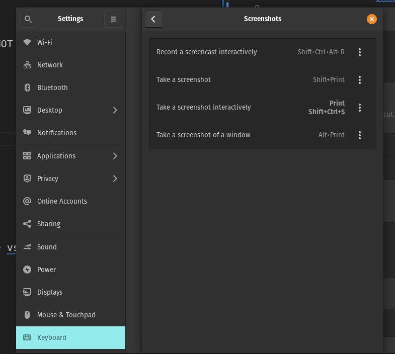
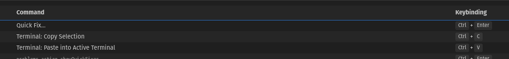

# Linux only stuff

Latest OS I'm using is Pop_OS as of 2024-05-27.

## Core setup

```bash
sudo apt install git zsh curl

# SETUP YOUR GIT CREDENTIALS
git config --global user.name "Your Name"
git config --global user.email you@example.com

# push the current branch and set the remote as upstream automatically every time you push
git config --global push.default current

# change git commit message editor to vscode
git config --global core.editor "code --wait"

```

Change shortcut to set take screenshot.




## Apps

- [Chrome](https://www.google.com/chrome/browser-tools/)
- [Slack](https://slack.com/downloads)
  - add as startup item.
- [Discord]
 - add as startup item.
- CopyQ
  - can be installed from Pop!shop but be sure to install as Deb, NOT FLAT PACK
  - Change settings
    - always on top
    - autostart
      - > option is missing if you install as flatpack!
    - show/hide main window as "ctrl + `"
    - Max number of items in history 600


## Terminal

Using built in terminal. this is important because you can't change vscode on linux to use a different app.

Change keybindings so `ctrl` + `c` is copy.
Change keybindings so `ctrl` + `v` is paste.

This means `ctrl` + `shift` + `c` is the kill command.


Setup zsh. 
 

Download "FiraMono Nerd Font" from https://www.nerdfonts.com/font-downloads
  
Set `FiraMono Nerd Font` as terminal font.


## VS Code

- Login and then sync with `Github account`
### VS Code Terminal



Change the terminal copy and paste commands.

This means `ctrl` + `c` is copy and `ctrl` + `v` is paste. But if command is running then `ctrl` + `c` will still kill command.

```json

{
        "key": "ctrl+c",
        "command": "workbench.action.terminal.copySelection",
        "when": "terminalFocus && terminalHasBeenCreated && terminalTextSelected || terminalFocus && terminalProcessSupported && terminalTextSelected"
    },
    {
        "key": "ctrl+shift+c",
        "command": "-workbench.action.terminal.copySelection",
        "when": "terminalFocus && terminalHasBeenCreated && terminalTextSelected || terminalFocus && terminalProcessSupported && terminalTextSelected"
    },
    {
        "key": "ctrl+v",
        "command": "workbench.action.terminal.paste",
        "when": "terminalFocus && terminalHasBeenCreated || terminalFocus && terminalProcessSupported"
    },
    {
        "key": "ctrl+shift+v",
        "command": "-workbench.action.terminal.paste",
        "when": "terminalFocus && terminalHasBeenCreated || terminalFocus && terminalProcessSupported"
    }

```

Download "FiraMono Nerd Font" from https://www.nerdfonts.com/font-downloads
  
Set `FiraMono Nerd Font` as terminal font, and editor font.
Download "FiraMono Nerd Font" from https://www.nerdfonts.com/font-downloads
  
Set `FiraMono Nerd Font` as terminal font, and editor font.